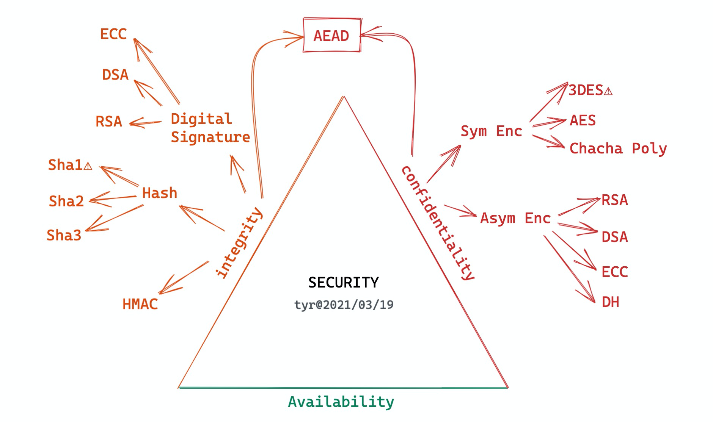
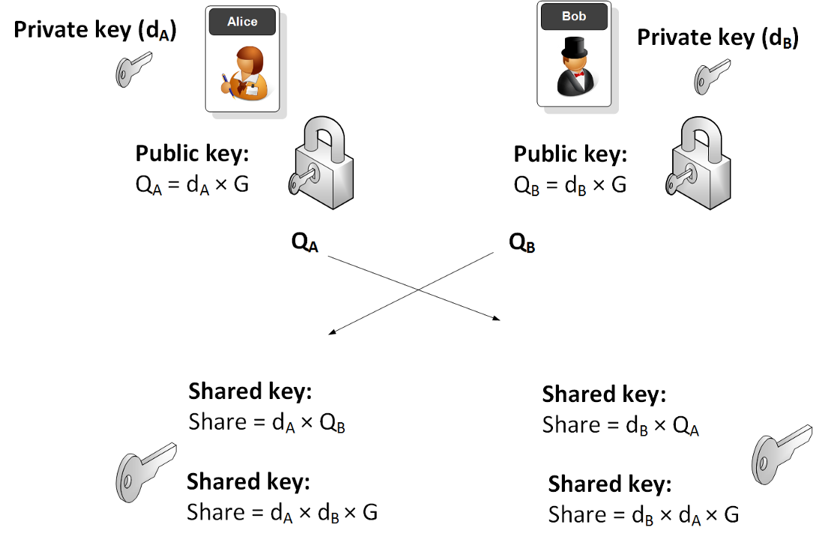
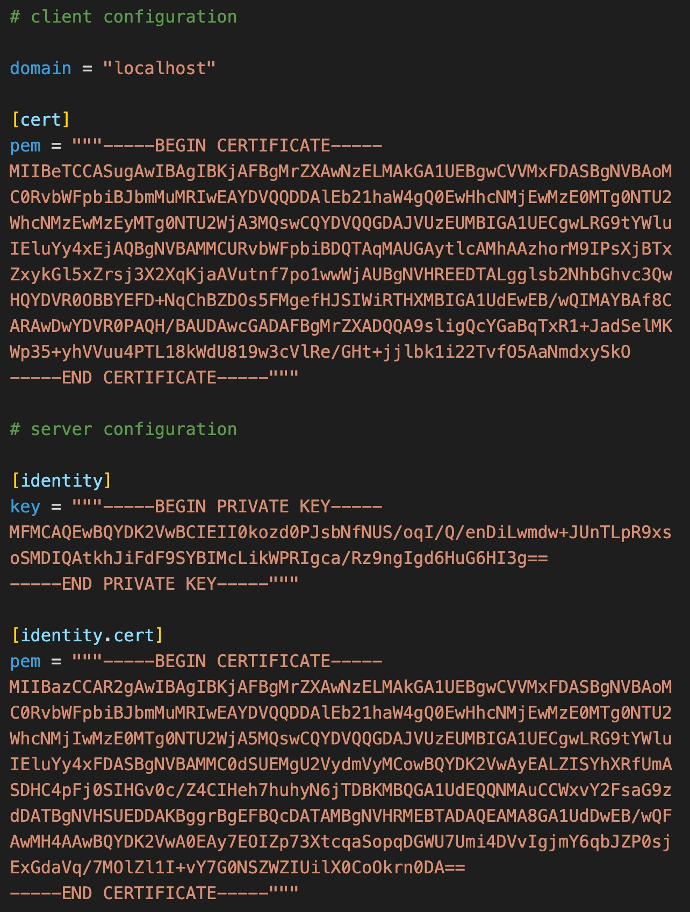
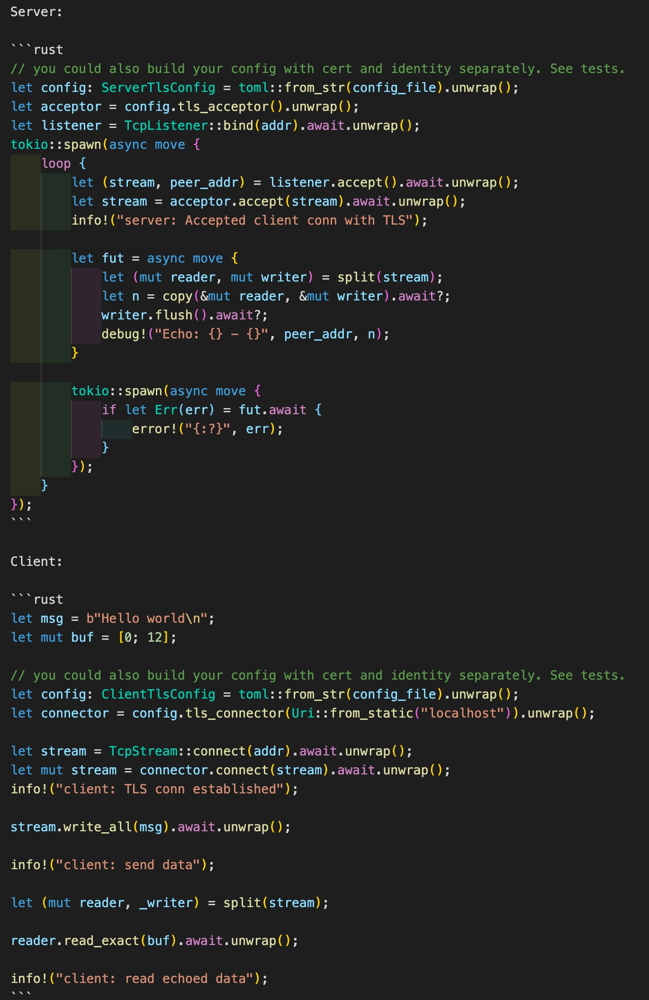

## Rust: 构建安全高性能的网络应用

---

### 当我们谈论网络安全的时候，我们在谈论什么？



---

## 应用层安全

- 使用标准协议 - TLSv1.3
- 构建你自己的安全协议 - Noise Protocol
- 应用层安全的基石：DH 算法



---

## Rust TLS 支持

- openssl
- rustls (基于 ring)
- tokio-tls-helper

---

<!-- _backgroundColor: #1e1e1e -->
<!-- _color: #e1e1e1 -->



### 配置

- 客户端：domain，CA cert
- 服务器：cert / key

---

<!-- _backgroundColor: #1e1e1e -->
<!-- _color: #e1e1e1 -->



### 代码

- 服务器
  - 加载配置 `ServerTlsConfig`
  - 准备好 `TLS acceptor`
  - `acceptor.accept(tcp_stream)`
- 客户端
  - 加载配置 `ClientTlsConfig`
  - 准备好 `TLS connector`
  - `connector.connect(tcp_stream)`

---

## Noise Protocol

- TLS vs Noise protocol：动态协商 vs 静态协商
- Noise_IKpsk2_25519_ChaChaPoly_BLAKE2s：
  - I：发起者的固定公钥未加密就直接发给应答者
  - K：应答者的公钥发起者预先就知道
  - psk2：把预设的密码（Pre-Shared-Key ）放在第 2 个握手包之后
  - ChaChaPoly：对称加密算法
  - BLAKE2s：哈希算法
- 协议最少 [0-RTT](https://noiseexplorer.com/patterns/X/) (x 或者 xpsk），之后就建立好加密通道，可以发送数据

---

## Noise Protocol 接口

- build：根据协议变量和固定私钥，初始化 HandshakeState
- write(msg, buf): 根据当前的状态，撰写协议报文或者把用户传入的 buffer 加密
- read(buf, msg)：根据当前的状态，读取用户传入的 buffer，处理握手状态机或者把用户传入的 buffer 解密
- into_transport_mode：将 HandshakeState 转为 CipherState
- rekey：在传输模式下，用户可以调用 rekey 来更新密钥

---

<!-- _backgroundColor: #1e1e1e -->
<!-- _color: #e1e1e1 -->


### 代码（0-RTT）

- Initiator:
  - 构建 `HandshakeState`
  - 发送握手数据
  - 进入传输模式
- Responder:
  - 构建 `HandshakeState`
  - 接收握手数据
  - 进入传输模式

---

## 如何 _安全_ 地，_确定性_ 地生成

### __密码/密钥/证书__？

---

## Cellar

- 受 Bitcoin HD wallet 启发（BIP-32 Hierachical Deterministic Wallets）
- 密码可以从一个根密码一层层派生下去
- 每个父密码可以派生子密码，结果跟从根密码派生一样

```rust
salt            = Secure-Random(output_length=32)
stretched_key   = Argon2(passphrase=user_passphrase, salt=salt)

auth_key        = HMAC-BLAKE2s(key=stretched_key, "Auth Key")
c1              = HMAC-BLAKE2s(key=stretched_key, "Master Key")
c2              = Secure-Random(output_length=32)
encrypted_c2    = ChaCha20(c2, key=auth_key, nonce=salt[0..CHACHA20_NONCE_LENGTH])

master_key      = HMAC-BLAKE2s(key=c1, c2)
application_key = HMAC-BLAKE2s(key=master_key, "app info, e.g. yourname@gmail.com")
```

---

<!-- _backgroundColor: #1e1e1e -->
<!-- _color: #e1e1e1 -->


## Cellar 代码

- 生成密码或 Ed25519 密钥
- 生成 x509 证书

---

## 构建高性能安全的网络


---

## 参考资料

- [tokio tls helper](https://github.com/tyrchen/tokio-tls-helper)
- [Noise 框架：构建安全协议的蓝图](https://zhuanlan.zhihu.com/p/96944134)
- [Cellar: 分层确定性密钥管理](https://github.com/tyrchen/cellar)
- [Conceal：使用 Noise protocol 做文件加密](https://github.com/tyrchen/conceal)

---

<!-- _backgroundColor: black -->
<!-- _color: lightgrey -->

## May the _Rust_ be with you
