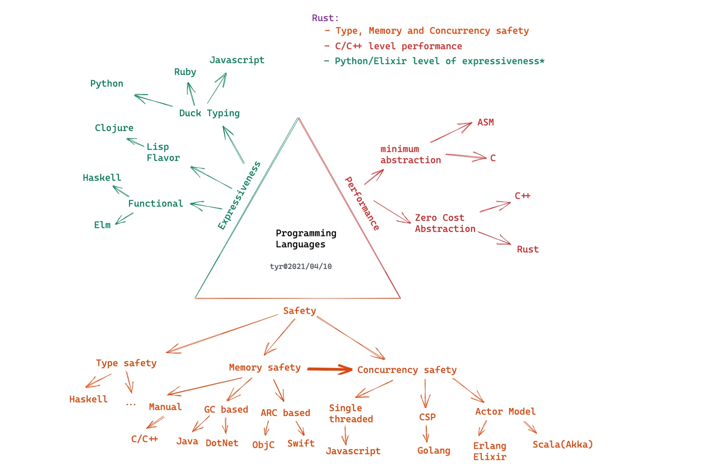
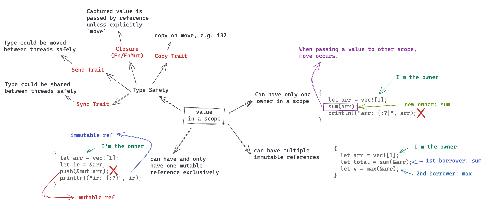
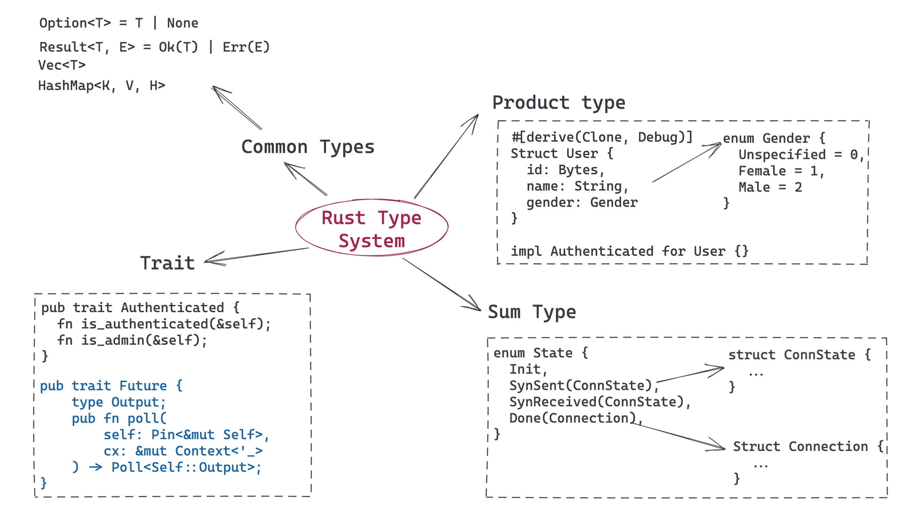
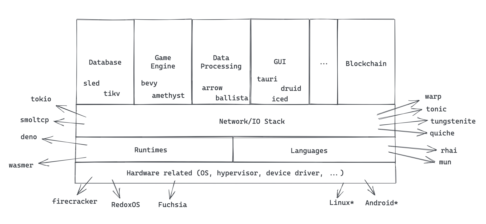
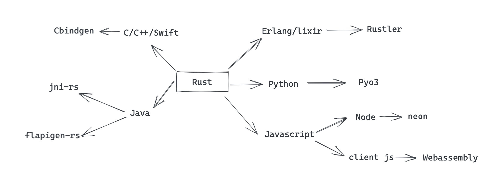
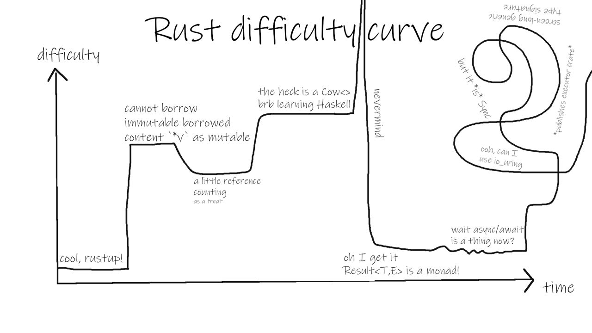

# Rust Trainings All in One

<style scoped>
    ul { columns: 2; width: 90%; }
</style>

- [High-level intro about Rust](#2)
- Ownership, borrow check, and lifetime
- Typesystem and data structures
- Concurrency - primitives
- Concurrency - async/await
- Networking and security
- FFI with C/Elixir/Swift/Java
- WASM/WASI
- Rust for real-world problems

---

<!-- _backgroundColor: #264653 -->
<!-- _color: #e1e1e1 -->

## High-level Intro About Rust

---

## Why Rust?

---

### Let's talk about values and tradeoffs first

<style scoped>
    ul { columns: 3; width: 90%; }
</style>

- Approachability
- Availability
- Compatibility
- Composability
- Debuggability
- Expressiveness
- Extensibility
- Interoerability
- Integrity
- Maintainabiity
- Measurability
- Operability
- Performance
- Portability
- Productivity
- Resilliency
- Rigor
- Safety
- Security
- Simplicity
- Stability
- Thoroughness
- Transparent
- Velocity

---

## C

<style scoped>
    ul { columns: 3; width: 90%; color: #ddd; }
</style>

- Approachability
- Availability
- Compatibility
- Composability
- Debuggability
- Expressiveness
- Extensibility
- Interoerability
- Integrity
- Maintainabiity
- Measurability
- Operability
- _Performance_
- Portability
- Productivity
- Resilliency
- Rigor
- Safety
- Security
- _Simplicity_
- Stability
- Thoroughness
- _Transparent_
- Velocity
---

## Erlang/Elixir

<style scoped>
    ul { columns: 3; width: 90%; color: #ddd; }
</style>

- Approachability
- Availability
- Compatibility
- Composability
- Debuggability
- Expressiveness
- Extensibility
- Interoerability
- Integrity
- Maintainabiity
- Measurability
- Operability
- Performance
- Portability
- __Productivity__
- _Resilliency_
- Rigor
- _Safety_
- Security
- _Simplicity_
- Stability
- Thoroughness
- Transparent
- Velocity

---

## Python

<style scoped>
    ul { columns: 3; width: 90%; color: #ddd; }
</style>

- _Approachability_
- Availability
- Compatibility
- Composability
- Debuggability
- _Expressiveness_
- Extensibility
- Interoerability
- Integrity
- Maintainabiity
- Measurability
- Operability
- Performance
- Portability
- _Productivity_
- Resilliency
- Rigor
- Safety
- Security
- _Simplicity_
- Stability
- Thoroughness
- Transparent
- Velocity

---

## Java (in early days)

<style scoped>
    ul { columns: 3; width: 90%; color: #ddd; }
</style>

- Approachability
- Availability
- Compatibility
- Composability
- Debuggability
- Expressiveness
- Extensibility
- Interoerability
- Integrity
- Maintainabiity
- Measurability
- Operability
- _Performance_
- _Portability_
- Productivity
- Resilliency
- Rigor
- _Safety (memory)_
- _Security_
- Simplicity
- Stability
- Thoroughness
- Transparent
- Velocity

---

## Rust


<style scoped>
    ul { columns: 3; width: 90%; color: #ddd; }
</style>

- Approachability
- Availability
- Compatibility
- Composability
- Debuggability
- _Expressiveness_
- Extensibility
- Interoerability
- Integrity
- Maintainabiity
- Measurability
- Operability
- _Performance_
- Portability
- _Productivity_
- Resilliency
- Rigor
- _Safety!!!_
- Security
- Simplicity
- Stability
- Thoroughness
- Transparent
- Velocity


---



---

## Why safety is important?

---

<!-- _backgroundColor: #f8f8f8 -->

<style scoped>
h6 {font-size: 16px;}
</style>


###### (Source: [Memory Safety Issues Are Still the Leading Source of Security Vulnerabilities](https://blogs.grammatech.com/memory-safety-issues-are-still-the-leading-source-of-security-vulnerabilities))

---

## Safety is hard!

- memory safety is not easy (you need to understand the corner cases)
- conccurency safety is really hard (without certain tradeoffs)
- Often you have to bear the extra layer of abstractions
  - normally it means performance hit

---

## Memory safety

- Manually - C/C++: painful and error-prone
- Smart Pointers - C++/ObjC/Swift: be aware of cyclical references
- GC - Java/DotNet/Erlang: mubch bigger memory consumption, and STW
- Ownership - Rust: learning curve

---

## Concurrency safety

- single-threaded - Javascript: cannot leverage multicore
- GIL - Python/Ruby: multithreading is notorious inefficient
- Actor model - Erlang/Akka: at the cost of memory copy and heap allocation
- CSP - Golang: at the cost of memory copy and heap allocation
- Ownership + Type System - Rust: super _elegant_ and _no extra cost_!

---

#### How Rust achieves

### _memory and conccurency safety_

#### without extra cost?

---



---

## Show me the code!
---

<!-- _backgroundColor: #1e1e1e -->
<!-- _color: #e1e1e1 -->


---

<!-- _backgroundColor: #1e1e1e -->
<!-- _color: #e1e1e1 -->


---


## Recap

<style scoped>
h5 {font-size: 20px; margin-top: 0px;}
h6 {font-size: 18px; margin-top: 40px;}
</style>

- One and only one owner
- Multiple immutable references
- mutable reference is mutual exclsive
- Reference cannot outlive owner
- _use type safety for thread safety_

###### With these simple rules, Rust achieved safety with
##### __zero cost abstraction__

---

## A glance at Rust Type System



---

## How's Productivity of Rust?

---

<!-- _backgroundColor: #1e1e1e -->
<!-- _color: #e1e1e1 -->


---

## Things built with Rust



---

## Should I use Rust?

- Rust is ideal when you need a system that reliable and performant
- Sometimes you don't, sometimes you do, sometimes you need that later
- it's all about tradeoffs

---

## Rust for our use cases

- parts of the system that are bottlenecks
  - bottleneck on computation
  - bottleneck on memory consumption
  - bootleneck on I/O
- parser/decoder/encoder
- wants to leverage existingC/C++/Rust ecosystem (e.g. you need blake3 for hashing)

---

## Rust FFI



---

## Learning rust as a(n)...

- Elixir eng: ownership model, type system, oh no mutation
- Scala eng: ownership model, oh no mutation
- Typescript eng: ownership model, multi-threaded programming
- Swift/Java eng: ownership model
- Python eng: ownership model, type system

---

## The common misunderstandings

---

### 1. Rust is super hard to learn...



---

### Rust is explicit

- Lots of knowledge about computer science is suddenly explicit to you
- If all your pain to learn a lang is 100%:
  - Rust:
    - Compiler help to reduce that to 90%
    - Then you suffer 70% the pains in first 3-6 months
    - Then the rest 20% in 3-5 years
  - Other:
    - You suffer 10-30% in first 3-6 months
    - Then 70%-90% in next 3-5 years
---

### 2. Unsafe Rust is evil...


---

<style scoped>
    ul { columns: 2; width: 90%; color: #ddd; }
</style>

## References

- [The pain of real linear types in Rust](https://gankra.github.io/blah/linear-rust/)
- [Substructural type system](https://en.wikipedia.org/wiki/Substructural_type_system)
- [Rust official book](https://doc.rust-lang.org/book/)
- [Rust official site](https://www.rust-lang.org/)
- [Awesome Rust](https://github.com/rust-unofficial/awesome-rust)
- [Are we web yet?](https://www.arewewebyet.org/)
- [Are we async yet?](https://areweasyncyet.rs/)
- [Are we gui yet?](https://www.areweguiyet.com/)
- [Are we learning yet?](http://www.arewelearningyet.com/)
- [Are we game yet?](https://arewegameyet.rs/)
- [Are we quantum yet?](https://arewequantumyet.github.io/)
- [Are we IDE yet?](https://areweideyet.com/)
- [Rust is for Professionals](https://gregoryszorc.com/blog/2021/04/13/rust-is-for-professionals/)

---

<!-- _backgroundColor: #264653 -->
<!-- _color: #e1e1e1 -->

## Ownership, borrow check, and lifetime

---

### Ownership/Borrow Rules Review


---

## Lifetime, not a new idea

---

#### Lifetime: Stack memory

```c
#include <stdio.h>
static int VALUE = 42;

void world(char *st, int num) {
    printf("%s(%d)\n", st, num);
}


void hello(int num) {
    char *st = "hello world";
    int v = VALUE+num;
    world(st, v);
}

int main() {
    hello(2);
}

```


---

#### Lifetime: Heap memory (tracing GC)


---

#### Lifetime: Heap memory (ARC)


---

## How Rust handles lifetime?

---

### Move semantics

---


---

### What a bout Borrow?

Think about: why does this work in Rust, but not C/C++?

---


---

#### Rust lifetime checker prevents this...


---

### Benefit of lifetime-constrained borrow

- can borrow anything (stack object, heap object)
- safety can be guaranteed at compile-time (no runtime lifetime bookkeeping)
- Rust borrow checker is mostly a lifetime checker

---

### Lifetime Annotation

- similar as generics, but in lowercase starting with `'`
- only need to put annotation when there's conflicts

```rust
// need explicit lifetime
struct User<'a> {
    name: &'a str,
    ...
}
fn process<T, 'a, 'b>(item1: &'a T, item2: &'b T) {}

// &'a User could be written as &User since on confliction
fn lifetime_example(user: &User) { // --+ Lifetime 'a
    if user.is_authed() {          //   |--+ Lifetime 'b
        let role = user.roles();   //   |  |
                                   //   |  |--+ Lifetime 'c
        verify(&role);             //   |  |  |
                                   //   |  |--+
    }                              //   |--+
}                                  // --+

fn verify(x: &Role) { /*...*/ }
```

---

### Static Lifetime

- 'static
- data included in bss / data / text section
  - constants / static variables
  - string literals
  - functions
- if used as trait bound:
  - the type does not contain any non-static references
  - owned data always passes a `'static` lifetime bound, but reference to the owned data does not

---

## Thread spawn

<style scoped>
    p { font-size: 24px; }
</style>

```rust
pub fn spawn<F, T>(f: F) -> JoinHandle<T>
where
    F: FnOnce() -> T,
    F: Send + 'static,
    T: Send + 'static,
{
    Builder::new().spawn(f).expect("failed to spawn thread")
}
```

The 'static constraint is a way of saying, roughly, that no borrowed data is permitted in the closure.

---

### RAII (Resource Acquisition Is Initialization)

- initializing the object will also make sure resource is initialized
- releasing the object will also make sure resource is released

---

### Drop Trait

- memory
- file
- socket
- lock
- any other OS resources

---

## demo

---


---

## Mental model

- write the code and defer the complexity about ensuring the code is safe/correct
- comfront the most of the safety/correctness problems upfront
- Mutate can only happen when you own the data, or you have a mutable reference
  - either way, the thread is guaranteed to be the only one with access at a time
- Fearless Refactoring
- reinforce properties well-behaved software exhibits
- sometimes too strict: rust isn't dogmatic about enforcing it

---

## References

- [Mark-And-Sweep (Garbage Collection Algorithm)](https://www.linkedin.com/pulse/mark-and-sweep-garbage-collection-algorithm-saral-saxena/)
- [Tracing garbage collection](https://en.wikipedia.org/wiki/Tracing_garbage_collection)
- [Swift: Avoiding Memory Leaks by Examples](https://medium.com/hackernoon/swift-avoiding-memory-leaks-by-examples-f901883d96e5)
- [Reference counting](https://en.wikipedia.org/wiki/Reference_counting)
- [Fearless concurrency with Rust](https://blog.rust-lang.org/2015/04/10/Fearless-Concurrency.html)
- [Rust means never having to close a socket](https://blog.skylight.io/rust-means-never-having-to-close-a-socket/)
- [Programming Rust: ownership](https://www.oreilly.com/library/view/programming-rust/9781491927274/ch04.html)
- [Crust of Rust: lifetime annotation (recommended)](https://www.youtube.com/watch?v=rAl-9HwD858)

---

## Cost of defects

- Don't introduce defect (this is impossible because humans are fallible).
- Detect and correct defect as soon as the bad key press occurs (within reason: you don't want the programmer to lose too much flow) (milliseconds later).
- At next build / test time (seconds or minutes later).
- When code is shared with others (maybe you push a branch and CI tells you something is wrong) (minutes to days later).
- During code review (minutes to days later).
- When code is integrated (e.g. merged) (minutes to days later).
- When code is deployed (minutes to days or even months later).
- When a bug is reported long after the code has been deployed (weeks to years later).

---

## Ownership and Borrow rules

- Use after free: no more (reference can't point to dropped value)
- Buffer underruns, overflows, illegal memory access: no more (reference must be valid and point to owned value)
- memory level data races: no more (single writer or multiple readers)

---

<!-- _backgroundColor: #264653 -->
<!-- _color: #e1e1e1 -->

## Typesystem and data structures

---

- The type system is relatively strong and prevents many classes of bugs.
- The borrow checker and the rules it enforces prevent safety issues at compile time. Some of these violations can be detected by other languages' compilers. However, in many cases sufficient auditing (like {address, memory, thread} sanitizers) is run much less frequently, often only in CI tests, which can be hours or days later.
- Invariants can be encoded and enforced in the type system through features like enums being algebraic data types.
- Variables are immutable by default and must be explicitly annotated as mutable. This forces you to think about where and how data mutation occurs, enabling you to spot issues sooner.
- Option<T> significantly curtails the billion dollar mistake.
- Result<T, E> forces you to reckon about handling errors.

---

<!-- _backgroundColor: #264653 -->
<!-- _color: #e1e1e1 -->

## Concurrency - primitives

---

<!-- _backgroundColor: #264653 -->
<!-- _color: #e1e1e1 -->

## Concurrency - async/await

---

<!-- _backgroundColor: #264653 -->
<!-- _color: #e1e1e1 -->

## Networking and security

---

<!-- _backgroundColor: #264653 -->
<!-- _color: #e1e1e1 -->

## FFI with C/Elixir/Swift/Java

---

<!-- _backgroundColor: #264653 -->
<!-- _color: #e1e1e1 -->

## WASM/WASI

---

<!-- _backgroundColor: #264653 -->
<!-- _color: #e1e1e1 -->

## Rust for real-world problems

---

<!-- _backgroundColor: black -->
<!-- _color: lightgrey -->

## May the _Rust_ be with you
