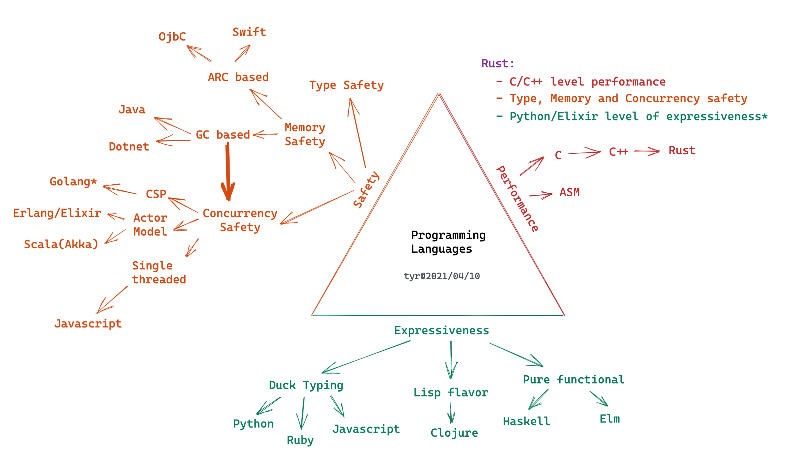

# Rust Trainings All in One

- [High-level intro about Rust](#2)
- Ownership, borrow check, and lifetime
- Typesystem and data structures
- Concurrency - primitives
- Concurrency - async/await
- Networking and security
- FFI with C/Elixir/Swift/Java
- WASM/WASI
- Rust for real-world problems

---

<!-- _backgroundColor: #264653 -->
<!-- _color: #e1e1e1 -->

## High-level Intro About Rust

---

## Why Rust?

---

---

## Why safety is important?

---

<!-- _backgroundColor: #f8f8f8 -->

###### (Source: [Memory Safety Issues Are Still the Leading Source of Security Vulnerabilities](https://blogs.grammatech.com/memory-safety-issues-are-still-the-leading-source-of-security-vulnerabilities))

---

## Why safety is hard?

- memory safety is not easy (you need to understand the corner cases)
- conccurency safety is really hard (without certain tradeoffs)
- Often you have to bear the extra layer of abstractions
  - normally it means performance hit

---

## Memory safety

- Manually - C/C++: painful and error-prone
- Smart Pointers - C++/ObjC/Swift: be aware of cyclical references
- GC - Java/DotNet/Erlang: mubch bigger memory consumption, and STW
- Ownership - Rust: learning curve

---

## Concurrency safety

- single-threaded - Javascript: cannot leverage multicore
- GIL - Python/Ruby: multithreading is notorious inefficient
- Actor model - Erlang/Akka: at the cost of memory copy
- CSP - Golang: at the cost of memory copy
- Ownership + Type System - Rust: very elegant and no extra cost!

---

## How Rust achieve memory safety and conccurency safety?

---

---

<!-- _backgroundColor: #1e1e1e -->
<!-- _color: #e1e1e1 -->

---

## Recap

- One and only one owner
- Multiple immutable references
- mutable reference is mutual exclsive
- _use type safety for thread safety_

###### With these simple rules, Rust achieved safety with
##### __zero cost abstraction__

---

## Zero Cost Abstraction

###### _Rust way of searching for solutions_

---

---

## Let's go to basics about types

- can be used any number of times
  - Other languages: this is how we works
  - Rust: Copy / Clone
- can't be used more than once
  - Other lanugages: ??
  - Rust: move semantics
- must be used at least once
  - Other lanugages: linter will detect that, hopefully
  - `unused_variables`, `unused_assignments`, `unused_must_use`
- must be used exactly once

---

## References

- [The pain of real linear types in Rust](https://gankra.github.io/blah/linear-rust/)
- [Substructural type system](https://en.wikipedia.org/wiki/Substructural_type_system)

---

---

## About memory safety

- C/C++

---

<!-- _backgroundColor: #264653 -->
<!-- _color: #e1e1e1 -->

## Ownership, borrow check, and lifetime

---

<!-- _backgroundColor: #264653 -->
<!-- _color: #e1e1e1 -->

## Typesystem and data structures

---

<!-- _backgroundColor: #264653 -->
<!-- _color: #e1e1e1 -->

## Concurrency - primitives

---

<!-- _backgroundColor: #264653 -->
<!-- _color: #e1e1e1 -->

## Concurrency - async/await

---

<!-- _backgroundColor: #264653 -->
<!-- _color: #e1e1e1 -->

## Networking and security

---

<!-- _backgroundColor: #264653 -->
<!-- _color: #e1e1e1 -->

## FFI with C/Elixir/Swift/Java

---

<!-- _backgroundColor: #264653 -->
<!-- _color: #e1e1e1 -->

## WASM/WASI

---

<!-- _backgroundColor: #264653 -->
<!-- _color: #e1e1e1 -->

## Rust for real-world problems

---

<!-- _backgroundColor: black -->
<!-- _color: lightgrey -->

## May the _Rust_ be with you
